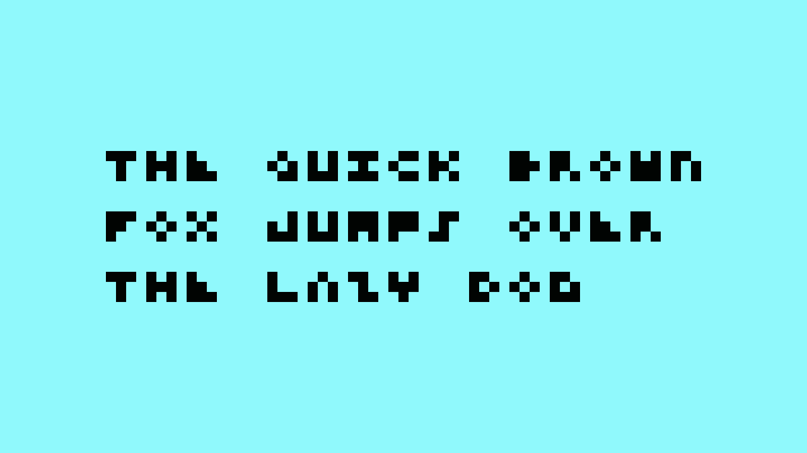
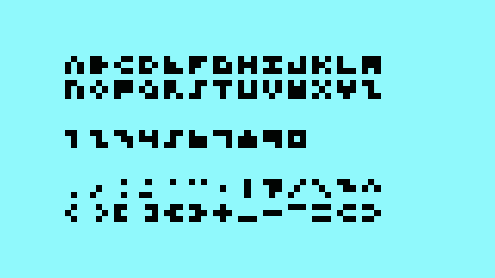

## 3x3 Mono Font

**The font is designed using a monospaced 3x3 grid.** 
**The font "3x3 Mono" contains 88 glyphs.**

**Recommended font size:** 
3, 6, 12, 24, 48 pt (points) 
4, 8, 16, 32, 64 px (pixel)  

